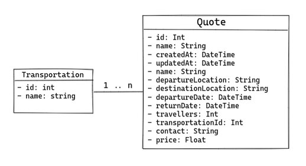

# Wet Bat Dashboard

## About the project

This is a prototype of a dashboard application for Wet Bat Travel.  
The repository contains the folders `/backend` and `/frontend` for the related layers described below.

## Back-end

The back-end app is a REST API responsible for processing the data stored in a relational database and providing some routes to the client. It was built with:

- Node.js
- TypeScript
- Express.js
- Prisma (ORM)
- Postgresql (Database)

**Data modeling**

- `Quote`: a model representing the main feature, containing all the relevant information for the prototype.
- `Transportation`: a model for the available transportations on travels.



**Architecture**

With the principle of separate of concern in mind, it was used a simplified layered architecture, dividing the app in two main layers:

- **Controller**: contains all the logic for handling the HTTP requests and responses on API routes.
- **Service/Model**: this single layer has the business logic and is responsible for integrating the routes with the data source.

**API Routes**

1. Show all existing quotes  
   Endpoint: `GET /quotes`

- `200 OK`

```json
{
   "quotes":[
      {
         "id":1,
         "name":"John Doe",
         "departureLocation":"Rio de Janeiro",
         "destinationLocation":"London",
         "departureDate":"2023-01-10T08:40:00.000Z",
         "returnDate":"2023-01-30T13:30:00.000Z",
         "price":876
      },
      {
         "id":2,
         "name":"Mary Jane",
         "departureLocation":"Rome",
         "destinationLocation":"Tokyo",
         "departureDate":"2023-03-12T14:30:00.000Z",
         "returnDate":"2023-03-20T04:00:00.000Z",
         "price":1495
      },
```

2. Show details about a specific quote  
   Endpoint: `GET /quotes/:id`

- `200 OK`

```json
{
  "quote": {
    "id": 3,
    "name": "Ted Mosby",
    "departureLocation": "New York",
    "destinationLocation": "Paris",
    "departureDate": "2022-12-01T05:00:00.000Z",
    "returnDate": "2022-12-30T18:00:00.000Z",
    "travelers": 4,
    "transportation": {
      "name": "Bicycle"
    },
    "contact": "ted@gmail.com",
    "price": 1250
  }
}
```

- `404 NOT FOUND`

```json
{
  "error": "Quote with given id not found"
}
```

### Running the project

#### 1. Install NPM dependencies

```sh
cd backend
npm install
```

#### 2. Create .env file

```sh
cp .env-example .env
```

Then, fill in the environment variables with your database credentials.

#### 3. Create database schema

```sh
npm run migrate:dev
```

#### 4. Seed database with initial data

```sh
npm run seed-db
```

#### 5. Run the project

```sh
npm run dev
```

The API will run on `http://localhost:PORT`.  
Where `PORT` is the specified value on `.env` file or `3000` as default.

## Front-end

### Running the project

#### 1. Install NPM dependencies

```sh
cd frontend
npm install
```

#### 2. Set-up variables

Create .env file

```sh
cp .env-example .env
```

Set the URL where the API is running

```sh
VITE_API_URL=http://localhost:3000
```

#### 2. Run the project

```sh
npm run dev
```

The project will run on `http://localhost:5173`.
